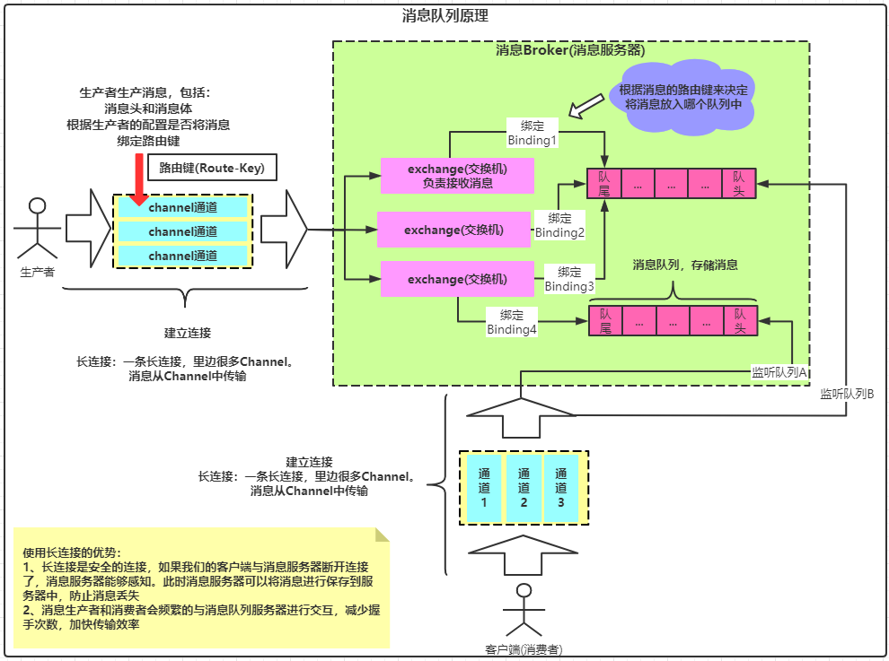

# mall

#### 介绍
基于SpringCloud + Nacos + Mybatis Plus + renren代码生成器 + MySQL + Redis缓存+ RabbitMQ消息队列 + ES搜索引擎 + ELK + OSS自己搭建企业级**B2C**电商项目。

#### 一、安装教程

* 简介：本项目是基于**guli商城**做的开发，其功能与**guli商城**一模一样，但项目结构是基于企业模式进行搭建的，比如有微服务之间依赖的具有远程调用的**feign client jar**包。只需要本地服务开启feign远程调用并添加对应包的扫描，同时将对应服务的client jar包引入即可完成**RPC**调用

1. clone代码

   ```shell
   git clone https://github.com/AvengerEug/avengereugmall.git -b develop
   ```

2.  执行如下代码进行编译

    ```shell
    cd avengereugmall && mvn clean -Dmaven.test.skip=true install
    ```

3.  本地需要起nacos服务，具体参考官网：[快速开始](https://nacos.io/zh-cn/docs/quick-start.html)。**ps: 以nacos默认的8848端口开启服务**

4. 启动对应的服务即可

5. 前端项目期待Node.js版本为**8.9.0**。踩坑遇到的，之前的Node.js版本为**12.18.3**，然后在install的时候报错了：

   ```txt
   gyp ERR! cwd D:\avengerEug\work\project\mall\renren-fast-vue\node_modules\node-sass
   gyp ERR! node -v v12.18.3
   gyp ERR! node-gyp -v v3.8.0
   gyp ERR! not ok
   Build failed with error code: 1
   npm WARN notsup Unsupported engine for watchpack-chokidar2@2.0.0: wanted: {"node":"<8.10.0"} (current: {"node":"12.18.3","npm":"6.14.6"})
   npm WARN notsup Not compatible with your version of node/npm: watchpack-chokidar2@2.0.0
   npm WARN optional SKIPPING OPTIONAL DEPENDENCY: fsevents@1.2.13 (node_modules\fsevents):
   npm WARN notsup SKIPPING OPTIONAL DEPENDENCY: Unsupported platform for fsevents@1.2.13: wanted {"os":"darwin","arch":"any"} (current: {"os":"win32","arch":"x64"})
   npm WARN optional SKIPPING OPTIONAL DEPENDENCY: fsevents@2.1.3 (node_modules\chokidar\node_modules\fsevents):
   npm WARN notsup SKIPPING OPTIONAL DEPENDENCY: Unsupported platform for fsevents@2.1.3: wanted {"os":"darwin","arch":"any"} (current: {"os":"win32","arch":"x64"})
   ```

   同时可能还需要安装python环境，执行如下命令(**以管理员的方式运行cmd执行如下命令**)即可：

   ```shell
   npm install --global --production windows-build-tools
   ```

   执行结束后，记得配置python的环境变量，默认安装在**C:\Users\{{当前用户名}}\.windows-build-tools\python27**下

#### 二、各服务端口映射关系

* 详细信息：

  |       服务名       |          作用          | 端口  |                             备注                             |
  | :----------------: | :--------------------: | :---: | :----------------------------------------------------------: |
  |    mall-common     | 各微服务共同依赖的模块 |  无   |                              无                              |
  |  renren-generator  |     代码逆向生成器     |  80   | 若需要启动它，需要将根目录的pom文件中的模块依赖加上(<module>renren-generator</module>) |
  |    api-gate-way    |        网关服务        |  88   |             微服务网关项目，根据host进行路由转发             |
  |   service-coupon   |       优惠券服务       | 7000  |                      连接mall-sms数据库                      |
  |   service-member   |        会员服务        | 8000  |                      连接mall-msm数据库                      |
  |   service-order    |        订单服务        | 9000  |                      连接mall-oms数据库                      |
  |  service-product   |        商品服务        | 10000 |                      连接mall-pms数据库                      |
  | service-warehouse  |        仓储服务        | 11000 |                      连接mall-wms数据库                      |
  |     service-es     |         es服务         | 12000 |                    操作elasticsearch服务                     |
  |    service-auth    |        认证服务        | 20000 | 其主要功能就是提供与登录相关的功能，目前只实现了用户名和密码的登录。未实现社交登录、sso等登录方式 |
  | service-thirdparty |       第三方服务       | 30000 |             与第三方服务对接(eg: OSS、短信等等)              |
  |    service-cart    |       购物车模块       | 40000 |          购物车服务，无db对应，主要是操作redis缓存           |

#### 三 nacos的使用

1. 注册中心的使用

    * Nacos的使用，alibaba仅提供了它的客户端，所以我们在使用的时候需要手动将nacos的服务端(下载nacos服务器并启动)启动起来，然后再使用`@EnableDiscoveryClient注解 + 固定配置`来注册
    
      ```txt
      几个注意点：
        1. 引入nacos client相关依赖(根据springcloud版本选择合适的nacos版本)
        2. 启动nacos服务
        3. 配置服务名名称(一定要配置，否则无法注册成功)
        4. 配置nacos注册中心地址
      ```
    
    * 具体参考官网: [nacos集成springcloud](https://nacos.io/zh-cn/docs/quick-start-spring-cloud.html)
    
    * Nacos控制台页面: http://host:port/nacos   **nacos/nacos**
    
2. 配置中心的使用：[参考官网详细链接：nacos-config使用手册](https://github.com/alibaba/spring-cloud-alibaba/wiki/Nacos-config)

    ps：nacos拥有全局开关、支持yaml文件(需要配置)、拥有namespace、group、dataId等特性。通常我们可以使用namespace + group的粒度来实现服务中环境的隔离(namespace来做服务之间的隔离，用group来做服务中环境的隔离)，或者使用profile的粒度来实现环境的隔离。

3. nacos与spring cloud版本之间的选择：[参考github中wiki详细说明](https://github.com/alibaba/spring-cloud-alibaba/wiki/版本说明)

#### 四、使用aliyun对象存储服务(oss)

* 为什么使用云存储服务(oss)

  ```txt
  当应用是单体架构时，不实用oss服务也没关系，我们直接把文件上传到应用的指定位置即可，然后由应用去访问。但是当请求量上来了之后，一台应用服务器很容易成为系统瓶颈，此时我们需要进行集群部署。在集群部署条件下，把文件上传到应用服务器上的方案将会变得不可取。此时我们可以选择自己搭建nfs文件服务器，然后所有的集群都使用这个nfs服务器，这种方案也是可行的，但是，这将增加了系统的维护成本，我们需要添加nfs服务器的维护人员，前期需要搭建，后期需要维护，比较费人力，因此我们推荐使用云存储服务，按量收费，对于我们系统而言，不需要维护这个文件存储服务，只需要按量付费即可，省时省力。
  ```

* 将文件上传到文件服务器的几种方式

  ```txt
  1. 使用表单将需要上传的文件传到后端，然后再让后端进行转存储至OSS。 ===> 缺点：表单提交时，一般是一个文件流，如果文件特别大，这将会成为一个系统瓶颈的隐患。
  
  2. 前端直接上传到OSS。
     此种模式又分为如下两种:
     2.1 前端直接使用accessKey和accessId直接与oss进行交互 ===> 缺点：不安全，accessKey和accessId都是比较敏感的数据，拥有这两个值就代表着拥有了操作OSS的权限(一般是一个账号对应一个accessKey和accessId)。
     2.2 将accessKey和accessId存在后端，每次前端上传图片前，请求服务端获取临时签名(存在过期时间或者一次性的签名)，然后前端将通过临时签名与OSS进行交互。
  ```


#### 五、自定义JSR303校验注解，允许一个Integer类型的值只能输入指定的值及JSR303规范使用总结

 * 1.创建对应的注解**AllowValues**

   ```java
   /**
    * 校验只能为指定的值
    *
    * JSR303规范：
    * 每一个JSR303注解必须同时包含message、groups、payload方法
    *
    */
   @Documented
   // 此注解指定了AllowVal校验由具体的解析器来处理，一个JSR303规范的注解能使用多个ConstraintValidator来校验
   @Constraint(validatedBy = { AllowValueConstraintValidator.class })
   @Target({ METHOD, FIELD, ANNOTATION_TYPE, CONSTRUCTOR, PARAMETER, TYPE_USE })
   @Retention(RUNTIME)
   public @interface AllowValues {
   
       /**
        * 将会在Classpath路径下找ValidationMessages.properties
        * 文件中包含key为com.avengereug.mall.common.utils.jsr303.valid.anno.AllowValues的value
        *
        * @return
        */
       String message() default "{com.avengereug.mall.common.utils.jsr303.valid.anno.AllowValues}";
   
       Class<?>[] groups() default { };
   
       Class<? extends Payload>[] payload() default { };
   
       /**
        * 配置允许的值
        * @return
        */
       int[] value() default { };
   }
   ```

* 2.创建`AllowValueConstraintValidator.java`类作为**AllowValues**注解的处理器

  ```java
  public class AllowValueConstraintValidator implements ConstraintValidator<AllowValues, Integer> {
  
      private Set<Integer> set = new HashSet<>();
  
      /**
       * 获取到注解初始化的值，并存入set中
       * @param constraintAnnotation
       */
      @Override
      public void initialize(AllowValues constraintAnnotation) {
          int[] value = constraintAnnotation.value();
          if (value.length > 0) {
              for (int i : value) {
                  set.add(i);
              }
          }
      }
  
      /**
       * 校验传入的value包含在 @AllowValues中指定的数组中
       *
       * @param value
       * @param context
       * @return
       */
      @Override
      public boolean isValid(Integer value, ConstraintValidatorContext context) {
          return set.contains(value);
      }
  
  }
  ```

* 3.在classpath(maven项目的话，在resources目录)下创建**ValidationMessages.properties**文件，并添加对应的信息

  ```properties
  com.avengereug.mall.common.utils.jsr303.valid.anno.AllowValues=请使用合法的值提交
  ```

* 4.在指定的字段中使用即可

  ```java
  @AllowValues(value = {0, 1})
  private Integer showStatus;
  ```

  上述代码，在controller中结合**@Validated** 修饰对应的实体类，即可完成对应的校验。具体参考**com.avengereug.mall.product.controller.BrandController#updateStatus**方法

* JSR303规范高级功能 - 分组

  以如下代码可知：

  ```java
  // BrandController
  public R updateStatus(@Validated(UpdateStatusGroup.class) @RequestBody BrandEntity brand){
      brandService.updateById(brand);
      return R.ok();
  }
  
  // BrandEntity
  @Data
  @TableName("pms_brand")
  public class BrandEntity implements Serializable {
  
      private static final long serialVersionUID = 1L;
  
      /**
       * 品牌id
       */
      @NotNull(message = "修改必须指定品牌id", groups = {UpdateGroup.class, UpdateGroup.class})
      @Null(message = "新增不能指定品牌id", groups = {SaveGroup.class})
      @TableId
      private Long brandId;
      /**
       * 品牌名
       *
       * @NotBlank注解不满足条件时的错误提示可以在ValidationMessages.properties文件中查看，
       * 或者在ValidationMessages_zh_CN.properties中查看中文版本的提示，
       * 如果也不满意的话，可以在注解中动态添加错误提示消息
       *
       */
      @NotBlank(message = "品牌名不能为空", groups = { UpdateGroup.class, SaveGroup.class })
      private String name;
      /**
       * 品牌logo地址
       */
      @NotBlank(message = "logo不能为空", groups = { UpdateGroup.class, SaveGroup.class })
      @URL(message = "logo必须是一个合法的URL地址", groups = { UpdateGroup.class, SaveGroup.class })
      private String logo;
      /**
       * 介绍
       */
      @NotBlank(groups = { UpdateGroup.class, SaveGroup.class })
      private String descript;
      /**
       * 显示状态[0-不显示；1-显示]
       *
       * 使用自定义注解，表示前端传来的数据只能为0或1
       *
       */
      @NotNull(groups = { UpdateGroup.class, SaveGroup.class })
      @AllowValues(value = {0, 1}, groups = { UpdateGroup.class, SaveGroup.class, UpdateStatusGroup.class })
      private Integer showStatus;
      /**
       * 检索首字母
       *
       * js中的正则为：/^[a-zA-Z]$/
       * 在java中，不需要前后的/
       */
      @Pattern(regexp = "^[a-zA-Z]$", message = "检索首字母必须是一个字母", groups = { UpdateGroup.class, SaveGroup.class })
      private String firstLetter;
      /**
       * 排序
       */
      @Min(value = 0, message = "排序必须大于等于0", groups = { UpdateGroup.class, SaveGroup.class })
      @NotNull(groups = { UpdateGroup.class, SaveGroup.class })
      private Integer sort;
  }
  ```

  spring mvc在使用JSR303规范校验时，会获取groups参数中包含UpdateStatusGroup.class的值的注解，并对相应的字段进行校验。如上所述，只有brandId和showStatus这两个字段应用了UpdateStatusGroup，所以在校验时，只会最这两个属性进行校验。

#### 六、商品服务，SPU&SKU概念&规格参数&销售属性

* SPU(Standard Product Unit)：标准化产品单元

  ```txt
  是商品信息聚合的最小单位，是一组可复用、易检索的标准化信息的集合，该集合描述了一个产品的特性
  ```

* SKU(Stock Keeping Unit)：库存量单位

  ```txt
  即库存进出计量的基本单元，可以是以件，盒，托盘为单位。
  SKU这是对于大型连锁超市DC(配送中心)物流管理的一个必要的方法。
  现在已经被申为产品统一编号的简称，每种产品均对应有唯一的SKU号。
  ```

* 规格参数和销售属性：每个分类下的商品共享规格参数与销售属性。只是有些商品不一定要用这个分类下全部的属性，他们具有如下特性：

  ```txt
  1. 属性是以三级分类组织起来的
  2. 规格参数中有些是可以提供检索的
  3. 规格参数也是基本属性，他们具有自己的分组
  4. 属性的分组也是以三级分类组织起来的
  5. 属性名确定，但是值是由每一个商品来决定的
  ```

#### 七、分析总结java不同的object

* 1、PO(persistant object) ：持久对象

  ```txt
  PO就是对应数据库中某个表中的一条记录，多个记录可以用PO的集合。PO中应该不包含任何对
  数据库的操作
  ```

* 2、DO(domain object)：领域对象

  ```txt
  就是从现实世界中抽象出来的有形或无形的业务实体
  ```

* 3、TO(transfer object)：数据传输对象

  ```txt
  不同的应用程序之间传输对象。最常见的就是微服务之间的传输
  ```

* 4、DTO(data tranfer object)：数据传输对象

  ```txt
  与TO类似
  ```

* 5、VO(value object)：值对象

  ```txt
  通常用于业务层之间的数据传递，和PO一样，也是仅仅包含数据而已。但应是抽象出的业务对象，
  可以和表对应，也可以不对应，这根据业务的需要。用new关键字创建，由GC回收，通常是使用vo
  对象来接收请求和或使用vo作为响应对象来响应请求。
  ```

* 6、BO(business object)：业务对象

  ```txt
  从业务模型的角度看，通常是多个PO的集合。比如一份简历可以有教育经历、工作经历、社会关系
  等等。其中，教育经历、工作经历、社会关系都是一个个的PO，所以可以把简历封装成BO
  ```

* 7、POJO(plain ordinary java object)：简单无规则的java对象

  ```txt
  传统意义的java对象。最简单的java bean，只有set和get方法。通常POJO是DP/DTO/BO/VO的统称
  ```

* 8、DAO(data access object)：数据访问对象

  ```txt
  通常是操作数据库的对象，比如项目中dao层的各种对象
  ```

#### 八、后端编写的几个军规

* 1、service的注入规范

  ```txt
  一般在当前service中要调用别的service，注入的是别的模块的service
  ```

* 2、controller中api的编写规范

  ```txt
   * controller层只要做三件事
   *
   * 1、处理请求：使用JSR303校验前端传入的数据
   * 2、调用service层方法，service层一般是处理完业务逻辑，返回通用的entity
   * 3、接收service返回的entity并组装成前端需要的vo进行相应
  ```

* 3、在高并发的系统下，不建议连表查询，建议分步查询。

#### 九、spring-cloud feign重名的坑

* 问题背景：

  ```txt
  当我们使用feign进行rpc调用时，通常要使用@FeignClint注解来标识当前的接口是一个feignClient，同时，我们需要添加name属性来指定当前的feign属于哪个服务下。但是，在SpringBoot 2.1之前，我们只需要添加如下配置:
  @FeignClient(name = "service-coupon")就能声明一个客户端了，但是在SpringBoot 2.1之后，我们这样写，如果引入了多个feign的client，name此时会抛出如下错误：
  ***************************
  APPLICATION FAILED TO START
  ***************************
  
  Description:
  
  The bean 'service-coupon.FeignClientSpecification' could not be registered. A bean with that name has already been defined and overriding is disabled.
  
  Action:
  
  Consider renaming one of the beans or enabling overriding by setting spring.main.allow-bean-definition-overriding=true
  
  原因就是feign的声明，在底层使用动态代理生成spring bean对象时，默认是使用如下规则生成的bean name：
  `beanName：name + "." + FeignClientSpecification.class.getSimpleName()`
  因此，会出现上述的错误：beanName已经存在，解决这个问题可以在后面添加一个ContextId, eg:
  @FeignClient(serviceId = "service-coupon", contextId = "couponClient"),
  或者和提示中的一样，添加spring.main.allow-bean-definition-overriding=true的配置
  ```

* 此问题具体参考：[https://blog.csdn.net/u012211603/article/details/84312709](https://blog.csdn.net/u012211603/article/details/84312709)

#### 十、BigDecimal类型数据的比较

* 应使用BigDecimal的compareTo方法进行比较

  |         类别         | 结论分析 |
  | :------------------: | :------: |
  | a.compareTo(b) == -1 |  a小于b  |
  | a.compareTo(b) == 0  |  a等于b  |
  | a.compareTo(b) == 1  |  a大于b  |

#### 十一、guli商城项目的坑 + 疑问

##### 1、坑

* 商品微服务(service-product)：

  |                              坑                              |                          解决方案                          |
  | :----------------------------------------------------------: | :--------------------------------------------------------: |
  | 基本属性信息管理，pms_attr表缺少value_type字段，导致在前端的多选、单选设置的radio无法正常工作 | pms_attr表新增value_type字段，并在相应的实体类中添加此属性 |
  |      pms_spu_info表中的品类字段写错了，写成了catalog_id      |       pms_spu_info对应模块的前后端对应的字段都要修改       |
  |      pms_sku_info表中的分类字段写错了，写成了catelog_id      |       pms_sku_info对应模块的前后端对应的字段都要修改       |


##### 2、疑问点：

* 单表查询时，若要拼接vo响应至前端，eg：在查找spuInfoEntiry时，响应给前端的vo包含categoryName，那么此时是先单表查询出spuInfoEntity然后循环遍历查询category进而获取categoryName还是将spuInfoEntity的所有categoryId获取出来，再使用in来查询出所有的category，最终再将所有的category的name填充至对应的spuInfoEntity呢？

#### 十二、B2C商城业务商品库存的特点

* B2C商城业务的商品库存的渠道统一来自于采购单，但是采购单的渠道分为如下两种：

  ```txt
  1、后台管理人员新增采购需求，并将采购需求与采购单相关联，最终再由采购人员根据采购单进行采购，同时采购单里面包含了将此次商品采购至哪个仓库，所以最终采购人员是将商品采购至具体的仓库中的。
  2、采购单除了由采购人员来手动添加外，还包含系统的自动预警，当系统发现某个商品的库存不足时，或者达到添加采购单的需求了，此时系统就会自动生成采购单。最终采购人员再根据这个采购单去采购具体的商品
  ```


#### 十三、以百万并发检索为前提，架构商品在es中的存储模型

* 首先，ES是一个分布式产品，它提供了存储、检索、聚合的功能，它是将数据存入内存的，所以我们无需担心内存不够的情况，因为内存不够的话我们可以多搭建几台ES做集群或者加内存条，这样的话存储的数据就会均匀分布在每一台实例上。但是，内存和服务器的价格非常贵，所以我们必须要保证存入ES的数据是有效、合法的。那什么叫有效、合法呢？举个栗子：在商品检索页面中，我们可以对商品的名称(SKU的标题)、价格区间、销量、规格参数、商品分类、品牌进行检索，那么我们是不是可以把商品的规格参数、名称和商品对应的id存入ES中呢？然后检索的时候，把检索结果中的商品id拿到，再到数据库中查找一些非检索字段的信息，比如商品图片、商品描述等等，进而组装成前端需要的VO进行返回。


##### 方案一：常用方式：以面向对象的方式存储

* 存储示例

  ```json
  // ES中存储的索引名：sku
  // 存储示例
  {
      "spuId": 1
      "skuId": 12,
      "categoryId": 225,
      "brandId": 5,
      "skuTitle": "iPhone XR移动联通电信4G手机 双卡双待 红色 64GB 官方标配 黑色 128GB 保值换新版",
      "saleCount": 5487,
      "price": 5299.0000,
      "attrs": [
      	{
      		"attrId": 2,
      		"attrName": "入网型号",
      		"attrValue": "A2108"
  		},
      	{
      		"attrId": 3,
      		"attrName": "品牌",
      		"attrValue": "Apple"
      	},
      	{
      		"attrId": 7,
      		"attrName": "拍照特点",
      		"attrValue": "HDR;光学防抖"
      	}
      ]
  }
  ```

  此种方式，我们能够很清晰的知道一个SKU在ES中存储的结构。在京东的商品列表检索页中，我们按照规格参数进行检索时，比如我们查询了**手机分类**下**屏幕尺寸规格**为**6.95英寸及以上**的手机，你会发现，它的规格参数检索列表变了，与没筛选**屏幕尺寸规格**为**6.95英寸及以上**时不一样，这也就说明了一个问题：**我们每做一次检索，都会将筛选出来**的数据的attrs中的属性做为检索参数呈现在前端的检索列表中。**针对于这个业务，我们只需要对筛选出来的数据的attrs做一次聚合操作即可。但是这种方式的存储有一个缺点：**它会存在冗余的数据**。我们在学SPU和SKU的概念时，知道一个SPU会存在多个SKU，换言之就是一个SPU下面的SKU中存储的规格参数属性是一摸一样的。拿上面的数据来举例，假设我们的spuId为1的商品下面有100个SKU(**题外话：所以这个商品的销售属性至少选择了10个，因为**100=10*10，在录入商品时，会根据筛选的销售属性做笛卡尔积来产生SKU**)。那说明就要冗余100个attrs属性，然后我们来假设一下，long类型占8个字节，String类型占用16个字节，那么一个attrs数组就占用了120个字节。因此，100个SKU最终就会冗余100 * 120b = 12000kb = 12M。针对这么一个商品就会浪费12M的内存空间，如果有10万个类似spuId为1的商品，那么此时就会浪费：100000* 12M = 1200G的容量。为了解决这个问题，我们可以考虑下第二种存储方式。


##### 方案二：拆分：将attrs属性存到专门存储attrs中的索引中

* 存储示例

  ```json
  // ES中存储的索引名：attrs
  
  // 存储示例
  {
      "spuId": 1
      "attrs": [
      	{
      		"attrId": 2,
      		"attrName": "入网型号",
      		"attrValue": "A2108"
  		},
      	{
      		"attrId": 3,
      		"attrName": "品牌",
      		"attrValue": "Apple"
      	},
      	{
      		"attrId": 7,
      		"attrName": "拍照特点",
      		"attrValue": "HDR;光学防抖"
      	}
      ]
  }
  ```

  使用这种方式，我们可以很完美的避免上述浪费的1200G容量的情况。但是它还有一个问题：它在动态检索过程中貌似性能并不高。在方案一中我们有说到，我们的规格参数检索条件动态生成的，也就是说，我们根据手机检索出来一大笔数据后，后续还需要对这些数据中的attrs做聚合分析，把公共的attrs抽取出来作为下一次的规格参数检索条件。在这种情况下，假设我们在检索手机条件时，检索出来的条件高达5000条，此时我们需要在ES客户端中，对这5000个商品的spuId对应的attrs属性做一次聚合，因为我们的信息是存在与ES中的，所以我们必须把这5000个spuId同时传给ES，ES才能针对这次请求做聚合，这就意味着我们需要在一个http请求中填充5000个spuId，spuId是long类型的，也就是说这次统计的请求的数据大小达到：5000 * 8kb = 40GB，这么大的数据量容易把带宽打死。这还只是单个请求的情况下，如果是高并发下，那带宽毫无疑问会被打死。


##### 结论

* 综上所述，这就类似于算法中的空间复杂度和时间复杂度的区别，鱼与熊掌不可兼得，我们以耗费空间为前提，可以提升时间，我们耗费时间则可以提升空间。对于2C电商业务而言，时间效率是非常宝贵的，因此，我们选择了第一种的存储模型来构建sku在es中的存储方式

* ES构建mapping关系

  ```shell
  # skuPrice 设置类型为keyword是为了保证商品精度问题
  #   skuImg默认图片，index:false => 此属性不支持检索
  #   doc_values: false => 设置为false，不支持聚合操作
  #   ==> 冗余的字段设置index和doc_values为false
  # hasStock => 对应页面中仅显示有货的筛选条件
  # hotScope => 热度评分，对应访问量最多的检索条件
  # skuTitle => 指定了分词器
  # attrs中设置了type为nested，防止es扁平化处理
  PUT /product
  {
    "mappings": {
      "properties": {
        "skuId": {
          "type": "long"
        },
        "spuId": {
          "type": "keyword"
        },
        "skuTitle": {
          "type": "text",
          "analyzer": "ik_smart"
        },
        "skuPrice": {
          "type": "keyword"
        },
        "skuImg": {
          "type": "keyword",
          "index": false,
          "doc_values": false
        },
        "saleCount": {
          "type": "long"
        },
        "hasStock": {
          "type": "boolean"
        },
        "hotScope": {
          "type": "long"
        },
        "brandId": {
          "type": "long"
        },
        "brandName": {
          "type": "keyword",
          "index": false,
          "doc_values": false
        },
        "brandImg": {
          "type": "keyword",
          "index": false,
          "doc_values": false
        },
        "catelogId": {
          "type": "long"
        },
        "catelogName": {
          "type": "keyword",
          "index": false,
          "doc_values": false
        },
        "attrs": {
          "type": "nested",
          "properties": {
            "attrId": {
              "type": "long"
            },
            "attrName": {
              "type": "keyword",
              "index": false,
              "doc_values": false
            },
            "attrValue": {
              "type": "keyword"
            }
          }
        }
      }
    }
  }
  ```


#### 十四、使用域名 + nginx 反向代理 + 负载均衡访问项目

* 思路：

  > 1、配置本机的hosts文件，指定**avengereugmall.com**绑定虚拟机的ip(eg: 192.168.220.133)，其实质是指向虚拟机的nginx，除此之外，后续的所有相关服务都会对应一些域名，因此需要在hosts文件中配置如下信息：
  >
  > | 127.0.0.1 |     avengereugmall.com     |
  > | :-------: | :------------------------: |
  > | 127.0.0.1 | search.avengereugmall.com  |
  > | 127.0.0.1 |  item.avengereugmall.com   |
  > | 127.0.0.1 |  auth.avengereugmall.com   |
  > | 127.0.0.1 |  cart.avengereugmall.com   |
  > | 127.0.0.1 |  order.avengereugmall.com  |
  > | 127.0.0.1 | member.avengereugmall.com  |
  > | 127.0.0.1 | seckill.avengereugmall.com |
  >
  > 2、虚拟机的nginx配置server模块，标识 **avengereugmall.com**域名绑定80端口，并配置反向代理至后台微服务的网关服务
  >
  > ```txt
  > 1、在nginx的默认配置文件的http模块中添加如下配置(目的是为了在如下文件夹中寻找其他的配置文件)：
  > include /usr/local/nginx/conf/conf.d/**.conf;
  > 2、在/usr/local/nginx/conf/conf.d文件夹中创建配置文件mall.conf, 并填充如下内容
  >  upstream malldomain {
  >      #指向windows的ip地址，一般是虚拟机最后面一个数字改成1，并且反向代理后微服务的网关服务
  >      server 192.168.111.1:88;
  >  }
  > 
  >  server {
  >          listen       80;
  >          server_name  avengereugmall.com *.avengereugmall.com;
  > 
  >          #charset koi8-r;
  > 
  >          #access_log  logs/host.access.log  main;
  > 
  >          location / {
  >              proxy_set_header Host $host;
  >              proxy_set_header X-Real-IP $remote_addr;
  >              proxy_set_header X-Forwarded-For $proxy_add_x_forwarded_for;
  >              proxy_pass http://malldomain;
  >          }
  > 
  >          #error_page  404              /404.html;
  > 
  >          # redirect server error pages to the static page /50x.html
  >          #
  >          error_page   500 502 503 504  /50x.html;
  >          location = /50x.html {
  >              root   html;
  >          }
  >  }
  > 3、让nginx重新加载配置文件
  > /usr/local/nginx/sbin/nginx -s reload
  > ```
  >
  > 
  >
  > 3、后台网关服务根据host的断言来进行路由转发(一定要放在最后面，否则所有相同的host转发都将转发至相同的服务)
  
* 踩到的坑：

  ```shell
  upstream malldomain {
  	#指向windows的ip地址，一般是虚拟机最后面一个数字改成1，并且反向代理后微服务的网关服务
  	server 192.168.111.1:88;
  }
  
  # 上面填写的ip地址，在一般情况下的确是将最后面一个数字改成1，但要注意windows的防火墙要关闭，nginx反向代理会失败，会报超时异常
  ```

  

#### 十五、压力测试

* 压力测试考察当前**软硬件**环境下系统所能承受的最大负荷，并帮助找出系统瓶颈所在。压力测试都是为了系统在线上

  的处理能力和稳定性维持在一个标准的范围内，做到心中有数。使用压力测试，我们希望找到很多种用其他测试方式

  (正常的测试是为了测试业务流程)更难发现的错误(**内存溢出、内存泄漏、并发情况下线程不安全**)。应该从如下几个方

  面来对系统进行压力测试：**重复、并发、量级、随机变化**。

##### 15.1 性能指标

* 相应时间(Response Time)：

  ```txt
  响应时间指用户从客户端发起一个请求开始，到客户端接收到从服务器返回的响应结束，整个过程所耗费的时间。
  ```

* HPS(Hits Per Sencond)：每秒的点击次数，单位是**次/每秒**(此指标一般不看)

* TPC(Transaction Per Second)：系统每秒处理交易数，单位是**笔/每秒**.(也可以理解成每秒处理业务的数量)

* QPS(Query Per Second): 系统每秒处理查询的次数,单位是**笔/每秒**

* 最大响应时间(Max Response Time): 指用户发出请求或者指令到系统做出反应的最大时间

* 最小响应时间(Min Response Time): 指用户发出请求或者指令到系统做出反应的最小时间

* 90%响应时间: 是指用户的响应时间进行排序, 90%的响应时间.

* 从外部看:

  ```txt
  1. 吞吐量: 每秒钟系统能够处理的请求数, 任务数
  2. 响应时间: 服务处理一个请求或一个任务的耗时
  3. 错误率: 一批请求中结果出错的请求所占比例
  ```

#####  15.2 windows下的tcp端口最大数量和回收时间导致回收率上升

* windows本身提供的端口访问机制的问题: 

  ```txt
  window提供给tpc/ip链接的端口为1024-5000,并且要四分钟来循环回收他们. 就导致我们在短时间内跑大量的请求时将端口占满.
  ```


##### 15.3 性能优化思考方向

* 思考方向

  ```txt
  1、数据库性能高不高，接口有没有走索引
  2、应用程序中的业务逻辑是否可以优化，使用空间换时间方式提供响应速度
  3、中间件的性能是否影响了响应速度，比如网关的转发、DNS的寻址
  4、网络IO，带宽很慢
  5、操作系统，内核内部对握手链接的实现细节
  ```

* 要对上述方向进行定位之前，我们要了解我们的项目是属于**I/O密集型**还是**CPU密集型**的项目。

  ```txt
  1、CPU密集型：
     概念：当前项目会进行大量的计算，比如查到了一堆数据还需要进行遍历、过滤等操作，这些操作都是直接操作
          CPU的，或者在性能监控中，能看到cpu的占用率达到百分之七八十的利用，那说明这也是cpu密集型应用
     优化：升级硬件，将CPU的核心数加上去就可以了。
     
  2、I/O密集型：
     概念：CPU占用率低，但是服务器的内存挤爆了、磁盘在疯狂的读取数据，网络传输的数据很大。这些都是属于
          I/O密集型的应用
     优化：换固态、加内存(加内存条、加应用运行内存)、添加缓存技术、提高网卡的传输效率就可以了。
  
  ```

  除此之外，如果是对应用程序进行优化时，我们需要监控JVM内存使用情况，比如**年轻代**和**老年代**的内存使用情况，

  进而进行针对性的优化。

##### 15.4 服务页面动静分离

* 步骤

  > 1、将静态资源移动至nginx中，可以定义一个规则：比如将每个微服务中所有页面的静态文件都放到nginx中叫mall的文件夹内，同时内部以服务名进行区分。
  >
  > eg: /usr/local/nginx/html/mall/product/static路径下存放的是product服务的classpath下的static文件夹下的所有文件
  >
  > 2、修改nginx配置文件(**对应avengereugmall.com域名监听的80端口配置文件**)，并添加如下内容
  >
  > ```json
  > location /mall {
  > 	root /usr/local/nginx/html;
  > }
  > ```
  >
  > 上述有如下两种含义：
  >
  > ```txt
  > 1、当使用avengereugmall.com/mall请求nginx时，会到/usr/local/nginx/html路径下去找mall文件
  > 2、当使用avengereugmall.com/mall/product/static/index/1.png请求nginx时，会到/usr/local/nginx/html路径下去找mall/product/static/index/1.png资源
  > ```
  >
  > 同时要注意：location后面的 **/mall** 不能改成 **/mall/**，localtion模块中的配置只是表示要获取哪些资源，就到配置下root中指定的路径去寻找
  >
  > 3、最好是在生成环境下这么玩，否则每次更改了一些js文件还要将文件同步至nginx中。
  >
  > 

##### 15.5 jvisualvm安装插件

* 在cmd命令行中执行jvisualvm命令启动jvisualvm(因为配置了java的环境变量，所以在cmd中直接输入命令，可以查找到对应的exe文件)
* 使用jvisualvm来监控jvm时，一般会添加**Visual GC**插件，要安装此插件可以通过菜单中**工具->插件**来定位，其中有个**设置**选项，我们要在线安装，所以需要配置下载插件的url，每个jdk版本使用的url不一样，可以参考此网站[https://visualvm.github.io/pluginscenters.html](https://visualvm.github.io/pluginscenters.html)来进行查询，eg，我的jdk版本为**1.8.0_131**，那么我们可以在上述网站中找到对应的jdk版本，点进去，并在最上方找到**updates.xml.gz**的路径，我的版本中路径为：https://visualvm.github.io/uc/8u131/updates.xml.gz，因此，直接把jvisualvm中下载插件的url修改成https://visualvm.github.io/uc/8u131/updates.xml.gz即可。

##### 15.6 jvm参数对调优的影响

* 我们设置**-Xmx1024m -Xms1024m -Xmn512m**，来设置堆内存大小为1G，以及新生代大小为512m，调大新生代的大小能保证**young gc**的次数减少，虽然**young gc**没有**full gc**那么耗时，但多多少少它也会耗时，这方面的原因我们也需要考虑到。所以增加新生代的大小可以减少**Young gc**的次数，进而减少gc影响的时间，进而增加接口的QPS。

#### 十六、分布式系统提高QPS神器 - 缓存

* 在系统设计中，我们的DB最好只承担**数据落地**角色，即把数据持久化。但是，因为我们大多数使用关系型数据库，所

  以它的每次查询都会将硬盘中的数据读取至内存，这里就会存在I/O操作，这是一个比较慢的操作，因此，为了提高系

  统接口的QPS，我们通常会引入缓存。

  **注意：这里的缓存不是本地缓存，在分布式系统中，本地缓存会出现非常大的问题**

##### 16.1 什么数据适用于缓存？

* 即时性、数据一致性要求不高的
* 读多写少的数据
* 举例：**商品分类、权限验证**信息这样的数据就适合存入缓存

##### 16.2 spring-boot-starter-data-redis中redisTemplate使用Lettuce的坑

> ```txt
> 使用spring-boot-starter-data-redis的
> stringRedisTemplate保存分类数据时，会出现非常严重的问题，
> 因为在springboot2.0之后，redisTemplate在初始化的过程中，默认使用的是Lettuce作为redis的客户端，
> 而Lettuce底层使用的netty通信，又因为netty存储堆外内存的概念，当我们没有显示的
> 指定netty的对外内存时，它会使用默认的jvm的-Xmx的参数。
> Lettuce的一些bug，导致netty的堆外内存没有正常释放，在高并发长时间交互redis的情况下，会频繁的进行
> 反序列化操作，因为反序列化是netty在处理，所以会用到netty的堆外内存，最终会导致netty堆外内存被占满，
> 进而触发OutOfDirectMemoryError的异常。
> 在高并发的情况下如果使用Lettuce操作redis，那么这个问题是一定会发生的，只是时间长短问题。
> 
> 解决方案：
> 1、升级Lettuce客户端版本，但是好像没有一个很好的解决方案
> 2、使用jedis客户端来替代Lettuce(直接在xml中配置即可，redisTemplate的自动装配支持根据依赖来决定
>    redisTemplate底层是使用哪种客户端来与redis进行交互)
> 3、使用其他的redis客户端来操作，eg：redisson
> ```

##### 16.3 优化首页获取三级分类api

* 优化方向：

  ```txt
  1、添加堆内存大小，防止年轻代的eden区太小，导致频繁出现Young GC。(Young GC的执行时间虽然比Full GC短，但
     多多少少也会影响到接口的性能)
  2、将嵌套与db进行交互，改成一次性从DB拿出所有，后续所有组装分类的操作都将基于JVM内存操作，减少到只与DB交互
     一次。
  3、引入缓存，将数据组装完成后放入缓存，下一次直接从缓存中获取。
  4、解决缓存穿透：不管有没有组装完数据，都要将对应的数据放入缓存，防止缓存穿透。(但其实这不是一个很好的方
     案，若恶意攻击者使用jmeter每次以不同的key进行攻击，这种方式不是特别好。此时应该使用布隆过滤器)
  5、解决缓存雪崩：对每个set进去的key设置随机过期时间
  6、解决缓存击穿：添加锁解决缓存击穿、或者设置key永远不过期，由运营人员通过api手动更新或删除key。
  ```

* 优化效果：在每秒100个并发的压测下，从每秒5个的QPS上升到每秒400的QPS，性能提升80倍。

##### 16.4 使用锁需要考虑到的问题

* 一般需要考虑如下问题：

  ```txt
  1、避免死锁  --- 添加过期时间
  2、避免删除他人添加的锁  --- 添加随机value
  3、最好使用重入锁  --- 验证当前的key和value是不是相同
  ```

##### 16.5 使用redisson框架实现redis分布式锁

* redisson框架是redis官网推荐的基于redis的分布式框架，其内部实现了许多分布式的功能，比如分布式锁、型号量等等。对于redis的分布式锁而言，不管我们使用spring的redisTemplate还是jedis或lettuce客户端来实现分布式锁都是非常麻烦的。因此我们要学习redisson这个神器。

* springboot项目集成redisson框架：redisson专门为springboot也开发了一个starter，我们可以使用它，参考链接：[https://github.com/redisson/redisson/tree/master/redisson-spring-boot-starter#spring-boot-starter](https://github.com/redisson/redisson/tree/master/redisson-spring-boot-starter#spring-boot-starter)。但我选择了最原始的依赖，不通过starter进行配置，因为通过starter进行配置需要额外编写配置文件，而我更倾向于java config的方式进行配置。通过java config的方式配置redisson参考教程：[https://github.com/redisson/redisson/wiki/2.-配置方法](https://github.com/redisson/redisson/wiki/2.-配置方法)

* 因为redisson底层内部实现了JUC下面的Lock接口，所以我们可以直接使用Lock接口中的tryLock、lock和unlock方法，上手简单。同时它内部还有一个叫看门口的机制，当我们调用加锁方式时，内部会对这把锁设置默认的30s过期时间，防止出现系统宕机出现死锁问题，当锁的过期时间达到了2/3时，此时又会继续续命。


##### 16.6 redisson的公平锁和非公平锁

* redisson也支持公平锁和非公平锁，默认是非公平锁(client.getLock("lockName"))，如果要获取公平锁的话，可调用如下api：

  ```java
  client.getFairLock("lockName");
  ```

  获取到锁对象后，使用JUC Lock接口下的lock、tryLock和unlock方法即可，加锁、解锁过程大同小异。

##### 16.7 redisson的读写锁

* 应用场景：并发读，互不影响。存在写锁，则需要进行同步。针对某个key的值，为了保证线程安全，当这个key在写

  的过程中，其他的读过程需要等待。

* 具体特点：

  ```txt
  1、只要存在写操作，那么后面的读操作就会阻塞。
  2、读读操作相当于无锁
  ```

##### 16.8 缓存一致性问题

* 常见的缓存一致性问题的解决方案一般有两种，分别是：**双写模式**和**失效模式**

* 双写模式：

  ```txt
  所谓双写模式指的是：
    当我们更新MySQL后，顺带把缓存的数据给更新了。在正常情况下，这也是能够实现的。如果缓存的内容比较简单，不需要通过复杂的计算得出，这也是可以的。但如果需要经过复杂的计算得出，这个时候我们更倾向于把缓存删除，体现懒加载的机制。
  ```

  使用双写模式在高并发情况下会出现问题：

  ```txt
  假设在高并发更新数据库的情况下，线程1比线程2先到底服务器，并且线程1和线程2都更新完了数据库，但是有可能线程1
  的机房与redis的机房离得比较远，导致在更新缓存的步骤中，线程2先更新完了缓存，然后线程1才更新。此时出现了线程
  时序错乱的问题
  ```

  解决方案：

  ```txt
  1、线程时序错乱问题，我们加锁能完美解决，但是加锁肯定会降低系统的QPS，如果对数据一致性要求没那么高，则不建
     议采用加锁的方式
  2、一般的缓存，我们都会添加过期时间，如果业务对数据一致性要求每那么高的话，可以采用最终一致性的方案来解决。
     比如给每个缓存的key设置过期时间，等过期时间一到，下一次的请求就会更新缓存
  ```

* 失效模式：

  ```txt
  所谓失效模式指的是：
    更新完MySQL后，直接把缓存删了。这体现了一种懒加载机制，这样就能保证每次获取到的数据都是DB最新的数据。
    但是这样也会有问题，比如线程一更新完了数据，删除了缓存，但是线程2更新完了数据后还没删除缓存，此时请求三来
    读取数据了，此时读取到的是线程一更新完的数据，也会出现缓存不一致的问题。
  ```

  解决方案：

  ```txt
  1、缓存的所有数据都设置过期时间，更新DB的同时把缓存删了。(设置过期时间主要是防止删除缓存的操作失败)
  2、在读写缓存之前添加分布式读写锁，读读情况下不会影响QPS，只有在写操作情况下，才会影响部分QPS
  ```

##### 16.9 缓存一致性最终解决方案

* 因为无论是双写模式还是失效模式都会出现问题，所以我们在架构缓存一致性情况时，应该往如下方向去考虑：

  ```txt
  1、如果是并发几率非常小的数据，比如: 用户个人信息、权限数据等等，不需要考虑缓存一致性问题，给缓存添加过期时
     间，每隔一段时间主动更新即可
  2、并发几率非常高的数据，可以使用canal订阅MySQl binlog的方式(canal会监听MySQL binlog日志，如果有DB有更新
     数据，则会通知canal)
  3、如果业务允许缓存一致性没有那么高，则可以跟第一点一样，给缓存添加过期时间，过期后再主动更新
  4、如果缓存一致性要求非常高，我们可以添加分布式读写锁，保证写数据时的线程安全以及后面的读数据一定能拿到最新
     的写数据
  ```

* 总结：

  1、我们能放入缓存的数据本就不应该是实时性、一致性很高的。如果实时性、一致性很高，我们应该直接查询db。

  2、我们不应该过度设计，增加系统的复杂性

  3、所以缓存一致性，一般是添加过期时间，以最终一致性的方案来实现数据一致性

  4、如果db查询很慢，而且实时性很高(总结中的第一条无法满足)，此时可以使用**分布式读写锁 + 过期时间**来保证一致性

#### 十七、Spring AOP机制的坑

* 我们知道，Spring的AOP支持Cglib和JDK动态代理，但最终只有public修饰的方法才能被代理成功。其次，我们还需要注意一点：我们的AOP底层是使用动态代理来实现的，也就是说我们最终增强的方法是在代理对象中。如果我们使用目标对象的方法调用了增强方法，此时其实是不生效的，而且其实调用的其实不是增强方。如下：

  ```java
// 我们为携带@Customize注解的方法进行了增强
  @Component
public class Test {
      
      public void run1() {
          run2();
      }
      
      @Customize
      public void run2() {
          
      }    
  }
  
  // 调用处：从spring上下文中获取Test对象
  Test test = SpringContextHolder.getBean(Test.class);
  // 当执行run1()方法时，此时内部调用的run2()方法就是run2方法，并不是增强的方法
  test.run1(); 
  
  // 此时调用run2方法，会执行代理增强的逻辑
  test.run2();
  ```

#### 十八、Spring Integration中Spring Cache组件的使用

* 参考官方文档：[https://docs.spring.io/spring/docs/5.1.17.RELEASE/spring-framework-reference/integration.html#cache](https://docs.spring.io/spring/docs/5.1.17.RELEASE/spring-framework-reference/integration.html#cache)

* Spring Cache中注解的使用细节：

  ```java
  // 将方法结果存入缓存中
  @Cacheable
  // 删除缓存  --> 缓存一致性的失效模式
  @CacheEvict
  // 更新缓存  --> 缓存一致性的双写模式
  @CachePut: Updates the cache without interfering with the method execution.
  // 组合多个缓存操作  --> 支持删除多个或者更新多个
  @Caching: Regroups multiple cache operations to be applied on a method.
  // 在类级别上，共享所有的缓存
  @CacheConfig: Shares some common cache-related settings at class-level.
      
  // 它允许存储value为null，因此它可以避免简单清醒下的缓存穿透情况
  ```

* Spring Cache特点及不足

  ```txt
  优点：
    1、所有缓存的抽象，我们可以使用各种缓存，redis、或者本地的concurrentHashMap等等
    2、简化开发，是cache的使用变成声明式的
    
  缺点：
    1、所有的key的过期时间都是相同的，容易造成缓存雪崩
    2、虽然可以配置允许缓存null值，能解决简单情况下的缓存穿透问题，但是不能防止使用脚本每次请求不同参数的恶意
       攻击
    3、内部虽然提供了synchronized的get方法，但是仅仅是jvm层面的锁，最终在解决缓存击穿的情况下，在高并发最坏
       情况下，部署了N个实例，则数据库会多查询N次
       
  总结：
    1、普通数据(读多写少)完全可以使用spring cache组件来实现
    2、实时性、一致性要求特别高的数据需要自己定制化开发，比如在解决分布式下的缓存击穿情况下，要加锁，此时可以
       自己使用aop来增强spring cache写方法，来实现分布式情况下的缓存击穿特性。
  ```


#### 十九、接口幂等性

* 幂等性概念：执行一次或多次的结果都是一样的。

  在编程范围内的如下操作：

  ```SQL
  1、boolean falg = true;
  2、UPDATE table SET name = 1 WHERE id = 2;
  3、DELETE FROM table WHERE id = 3;
  4、SELECT * FROM WHERE id = 10;
  ```

  在数学范围内的如下运算：

  ```txt
  10 / 1 = 10
  1的n次方等于1
  ```

* 在编程中，什么样的操作需要考虑接口幂等性

  ```txt
  1、扣款操作：在调用第三方扣款接口之前，也要保证接口幂等性
  2、微服务间的调用：因为微服务间调用会有重试机制，因此要根据接口的操作性质做接口幂等性的保证
  3、下单操作：用户可能多次点击下单
  ......
  ```

* 处理方案：

  |     解决类别      |                           解决方案                           |                             示例                             | 缺点                                                         |
  | :---------------: | :----------------------------------------------------------: | :----------------------------------------------------------: | ------------------------------------------------------------ |
  |     唯一约束      | 除了自增id外，还需要添加一个业务id，并且将这个业务id添加唯一约束，这样就能防止重复插入了。 |      在订单表中，添加一个order_no字段，并且添加唯一约束      | 有唯一约束的存在，每次插入表都会校验这个唯一约束，会导致插入变慢 |
  |     token机制     | 每个需要幂等性的接口在调用之前，预生成一个token，在执行这个接口的时候，需要验证token | 比如用户在页面中点击确认下单前，在后台生成一个验证码存入redis中，同时将验证码也返回到前端页面，方便后续下单时携带令牌 | 1、用户体验极差<br>2、需要保证token的校验的安全性(获取令牌和删除令牌是原子操作) |
  |   数据库乐观锁    | 为表添加一个版本号字段，每次更新前拿到它的版本号，然后在where条件中添加这个版本号信息 | 一般在服务间远程调用触发重试机制用的比较多。一般是适用于**读多写少**的场景 | 会加大sql运行的负担，每一条记录的版本号可能是重复，因此有可能会造成全表扫描 |
  | redis set数据结构 | 根据业务数据生成一个MD5值，并存入redis中。只有redis中的set不存在，则执行业务 | 在调用下订单服务时，根据参数生成MD5值，然后放入redis的set中，根据redis将值放入set的这个操作的结果就能判断出这个结果是否存在，进而判断这个业务是否被处理了 |                                                              |
  |      防重表       | 在DB中添加一个防重表，每条记录对应一个业务，并对字段添加唯一约束 | 每次操作业务时，会将参数生成一个md5值，并插入防重表中。具体原理和存入redis 中的set集合类似。 |                                                              |

  

#### 二十、验证码防刷功能

> * 需求
>
>   ```txt
>   1、验证码5分钟内有效
>   2、同一个用户60s内不允许重复调用发送验证码功能
>   ```
>
> * 实现思想
>
>   ```txt
>   1、把验证码存入redis中，其中用户的手机号作为key，而一般在使用redis时，由于它是中间件，因此一般是有一些前缀标识的
>     在此处的前缀为：  "auth:sms:code:"   标识为auth服务的sms模块的验证码功能。
>     eg：完整的key为：  "auth:sms:code:15512345678"
>     同时需要设置它的过期时间来完成它的有效期功能。所以我们在存储时可以指定它过期的时间
>   
>   2、同时，我们还需要对value做文章，在存储value时，把当前操作redis的时间也存进去，这样就能标识这个redis是时候存入的。
>     eg：我们可以存储的value为： yzm_60   它代表的含义为验证码的值为yzm, 60s后过期
>      所以当一个用户一直调用发送验证码功能时，我们可以先从redis获取，再使用_分割，拿到它的过期时间expiredTime，
>      然后再将当前请求发送验证码的时间与expiredTime做减法运算。
>      如果小于60，则认为是在60s内一直调用发送验证码的功能，此时直接返回错误信息。
>      如果大于60，则认为是正常的情况：用户在60s后重新调用了发送验证码的功能，此时应该要发验证码，并且覆盖上一次获取的验证码，由
>      新验证码覆盖redis的旧验证码
>   ```
>

#### 二十一、分布式系统的session问题

##### 1、几种解决方案

1. **session复制**解决方案

   ```txt
   session复制解决方案是基于Tomcat来的，这是Tomcat自带的功能，修改一些配置就能实现多个tomcat实例的session共享功能。
   
   缺点：
     1、session复制的功能是基于网络传输的，也就是有可能出现我请求到你的服务器了但是你的服务器还没有同步session
     2、占用tomcat所处服务器的带宽，会影响到主业务的带宽
   优点：
     tomcat原生功能，降低开发难度，适用于小型系统。
   ```

2. **客户端存储**解决方案

   ```txt
   将session信息存在浏览器端，有客户端来保存用户的session信息，每次请求都把session放在请求头中，后端根据参数来辨别。
   
   缺点：不安全，不推荐！
   优点：降低服务器的存储，无延迟
   ```

3. **Hash一致性**解决方案

   ```txt
   将请求ip作为key，利用hash算法，将同一个ip的请求永远落在同一台机器中。只需要修改nginx的相关配置，负载均衡时利用ip做hash，保证同一个ip最终击中后台同一个服务器实例。
   
   缺点：
     1、丢失状态：若命中的服务节点服务器突然间重启了，那么用户的session就没了，下次同一个ip来访问时，就是未登录状况了。
     2、不利于扩展：若服务器实例做了水平扩展，此时我们需要修改nginx的配置，重新编写hash算法
     3、若换了不同的ip后，用户的当前请求对服务端而言就不是登录状态了，需要重新登录了
   优点：
     1、简单，相对于上述两种比较可靠。因为最坏的情况就是出现，用户需要重新登录一次
   ```

4. **中间件**统一存储

   ```txt
   将session信息统一存在一个中间件内，比如MySQL、Redis、MongoDB等。
   
   缺点：
     1、引入中间件，提升系统的复杂度
     2、增加了一次网络调用(IO)
   优点：
     1、session的功能与服务端解耦了，不管服务端实例怎么扩容，都不影响session的存储和同步
     2、无安全隐患
     3、不需要解决域名问题
   ```

5. **JWT**

   ```txt
   JWT(Json Web Token)是一种协议。它是一串被加密的口令，里面可以存放我们指定的各种信息，也有失效时间。基本上前后端分离的项目都会采用JWT的方式来做session方案
   ```

* 总结：

  ```txt
  session共享的解决方案常用的有三种：
  1、hash一致性
  2、中间件统一存储
  3、JWT
  
  对于负载压力不大的项目，又要做集群部署的话，可以采用hash一致性方案，因为压力不大，基本不会出现扩容的情况。
  对于负载压力大的项目，而且没有采用前后端分离的架构，因此我们一般会采用把session信息存入redis中。
  对于负载压力大的项目，而且是前后端分离的项目，我们首先采用的是JWT的解决方案。
  ```

##### 2、使用spring session解决非前后端分离项目的session问题

* sessin的作用域

  ```txt
  session是有作用域的，如果我们的域名变了，session是不能共享的。比如我一个项目有多个域名，分别为：avengereug.com; avengereugorder.com;
  这两个域名是不同的，因此在avengereug.com中的session是不能和avengereugorder.com共享的。因此，我们必须保证我们的所有系统域名要规范，即规范的使用子域名。因为session有子域名共享的机制，也就是说我在.avengereug.com作用域下的信息是能被他及其子域名共享的。即，我的order.avengereug.com是能共享到.avengereug.com域名下的session信息的。
  ```

* 集成spring session步骤：

  ```txt
  1、根据官网springboot使用redis来集成spring session文档做集成：
  https://docs.spring.io/spring-session/docs/2.4.0/reference/html5/guides/boot-redis.html
  2、为了跨语言，应该修改spring session的序列化方式，修改成统一的json格式
     2.1、修改spring session存入redis的序列化方式：
          https://docs.spring.io/spring-session/docs/2.4.0/reference/html5/#custom-redisserializer
3、修改session的作用域，应该作用到父域名
     3.1、修改session存到客户端cookie中的配置
          https://docs.spring.io/spring-session/docs/2.4.0/reference/html5/#api-cookieserializer
  ```
  
* 具备的功能：

  ```txt
  Spring Session对httpsession进行了增强改造，在set值到session时，会将数据同时保存到redis中。每次请求时，都会将redis中的值放到session中，并返回给
  客户端（但需要同时将spring session的配置添加到每个微服务中，保证它能从redis中取值、将redis中的值放到session中）。
  ```

#### 二十三、购物车业务需求

* 购物车的存储位置：**统一存在redis中，使用redis hash的数据结构进行存储**

* 在购物需求而言，不管用户是处于登录状态，还是用户退出了登录，购物车的信息都还能找到。因此，有一个追踪点就是：前端的cookie需要保存用户的信息，如果用户没有登录，则需要生成一个临时的**user-key**。就算用户登录了，也要生成一个临时的**user-key**。后续的所有购物车相关的东西，都从这个**user-key**来获取。因此，可以判断，这个**user-key**是用户的一个标识身份，就算你是登录的用户还是为登录的用户都会为你生成一个**user-key**，然后根据这个**user-key**来保存购物车的信息。所以我们需要在请求购物车信息之前就把这个**user-key**的事情给做了(使用spring mvc的拦截器功能)，同时要为这个**user-key**设置过期时间，设置当前使用浏览器的用户的购物车数据最多存储时间为一个月，以及需要将它cookie的作用域放大，后续可能会使用到这个**user-key**。所以，这里会涉及到几个技术点：

  ```txt
  1、会使用到spring mvc的拦截器。执行之前：构造user-key。 执行之后：为user-key设置过期时间
  2、使用ThreadLocal，保证同一个线程中能获取到当前的用户信息，这样在实际处理中就能知道用户是处于登录状态还是未登录状态了。
  ```

* 购物车在redis中存储的模型：主要以redis的hash数据结构来存储，其一些需求即对应redis的一些操作为：

  > 背景：购物车以**cart:{userId}为key**，value为值进行存储
  >
  > 1、若需要获取用户购物车中一共包含几种商品：**只需要获取购物车的hash的个数即可，一个hash对应一个商品**
  >
  > 2、若需要获取用户购物车中的总商品数量：**需要获取每一个map，并根据每一个map中的count来做聚合累加**
  >
  > 3、添加一个商品到购物车：**为购物车的hash添加一个元素**
  >
  > 4、修改某一件商品的数量：**获取指定的元素，并修改它的数量**
  >
  > 5、删除购物车中的某件商品：**删除一个元素即可**
  >
  > 6、获取购物车的总价格：**遍历所有的元素，对数量和count加运算，并累加**

* 购物车查询时的注意事项：

  ```txt
  1、查询购物车时，针对购物车的价格字段每次都要做更新。防止商家对商品价格进行了修改，购物车中商品的价格还不是最新的
  ```


#### 二十四、消息中间件

* 消息中间件常用的几大功能：**解耦、异步、限流**
* 通常我们在进行业务处理时，会遇到在同一个接口中处理非常多的事情，但有些事情针对于主业务而言是不太关注的，此时我们可以使用消息队列来将业务进行**异步**处理，提高主流程的响应速度。
* 通常我们在开发业务时，会经常出现反向依赖的情况。例如，我们开发一个下订单的服务，下完订单后，需要将库存减少。但是呢，如果口库存的接口进行了升级，修改了返回值的类型或者个数。这个时候我们需要同时修改下单的接口。此时是属于**反向依赖**的情况。我们应该在库存扣减完成时发送一条消息，在下订单扣减库存后的剩余逻辑应该由监听这个消息来进行处理。
* 通常我们在设计秒杀业务时，我们的服务器每秒只能处理**100**个请求。但秒杀业务通常会有大量的请求过来，比如此时由100万个请求过来，但是我们的服务器每秒只能处理100个请求。此时我们应该引入消息中间件，如果我们没有对接口进行降级处理的话，服务器会宕机的。若我们引入了消息中间件，我们把所有的请求都发送一条消息，由这个消息的监听者来处理下单请求。因此，我们的服务器要把推模式改成**拉模式**，同时要将消息的处理改成**同步方式**。这样就能真正的起到限流的作用了。

##### 24.1 消息中间件原理



##### 24.2 RabbitMQ消息中间件

* 详细的消息中间件相关知识点可参考自己写的博客：[消息队列之RabbitMQ:一篇文章了解RabbitMQ特性](https://blog.csdn.net/avengerEug/article/details/105481451)，内部包含了RabbitMQ消息队列的**安装方式**、常用的**四种交换机**以及**死信队列**、**备用交换机**等知识点。

##### 24.3 @RabbitListener和@RabbitHandler的区别

* ```txt
  使用@RabbitListener和@RabbitHandler来组合使用，来处理多个监听者监听同一条队列并且队列中消息的参数类型不同的情况
  如下：若我们将发送消息时，分别发送了不同类型的消息对象QueryParam和QueryParam2。因为我们每一个消息消费者的方法签名上定义了参数名的类型，如果我们只用@RabbitListener注解来处理这种情形的话，我们需要指定重复的队列，这种写法代码有点冗余，因此可以使用@RabbitListener和@RabbitHandler来处理。比如当前类的写法。但实际上，我们的每个消息队列应该是职责单一的，最好是一条消息队列处理一种业务。这样的话，能简化、方便开发
  ```

*  @RabbitListener和@RabbitHandler组合使用的demo

  ```java
  @RabbitListener(queues = "test.fanout.queue")
  @Component
  public class MakeOrderHandler2 {
  
      private static final Logger LOGGER = LoggerFactory.getLogger(MakeOrderHandler2.class);
  
      @RabbitHandler
      public void handler(QueryParams message) {
          LOGGER.info("接收到消息，消息内容：{}, 消息类型：{}", message, message.getClass());
      }
  
      @RabbitHandler
      public void handler(QueryParams2 message2) {
          LOGGER.info("接收到消息，消息内容：{}, 消息类型：{}", message2, message2.getClass());
      }
  }
  ```

##### 24.4 使用@RabbitListener注解处理的一些常用且易错的场景

* 场景一：我们的服务在生产环境部署时，都是集群式部署的，这就意味着，同一条消息队列可能会出现多个相同的消费者，。假设此时生产者生产了一个消息，服务的每个实例都会消费到这条消息，那是否要做消息幂等性的处理呢？

  ```txt
  在使用@RabbitLIstener注解标识消费者时，就算我们的服务是集群部署的，但是每一条消息有且只有一个消费者能够消费到。不可能出现多个消费者同时消费同一条消息的情况。但消息幂等性还是要考虑的，为什么呢？因为有可能会有重试机制，或者消费者连续发送了相同的消息，我们得保证消息消费者的业务逻辑的幂等性。
  ```

* 场景二：如果消费者正在处理一条消息时，生产者正在生产第二条消息，并且将第二条消息发送给消息中间件服务器了，此时消费者会紧接着处理第二条消息么？

  ```txt
  答案是：不会。只有消费者将当前业务逻辑都执行完毕后，才会继续消费后面的消息。也就是说，如果我消息处理业务逻辑有10s，那这10s内当前的消费者是不能处理其他消息的。进而得出结论：消费者处理消息的逻辑是同步的。
  ```
  
* 场景三：如何保证一个消息能有多个消费者同时消费呢？

  ```txt
  要解决这个问题得了解下消息中间件的工作机制。当生产者生产消息到消费服务器时，其实它的本质只是将消息发送给消息中间件的exchange组件。具体发送到哪一条队列上，这取决于exchange的类型和与它绑定的队列的routingKey。假设这个交换机是fanout类型，如果我们的一条消息有多条消费者感兴趣的话，我们应该创建多条队列，并且每个消费者只跟对应的队列进行绑定，由于fanout类型交换机的特性，我们在生产消息时，交换机就会广播所有的与之绑定的队列，达到一个消息有多个消费者同时消费的目的。如果这个交换机是direct、topic类型的话，需要保证routingKey和生产消息指定的routingKey一致，才能保证交换机同时将消息路由到多条消息队列中去
  ```

##### 24.5 RabbitMQ可靠消息投递和可靠抵达策略

###### 1、可靠消息投递：confirmCallback

* 重写rabbitTemplate的**confirmCallback**方法来保证生产者将消息发送给消息服务器Broker组件

  ```txt
  我们可以重写rabbitTemplate的confirmCallback方法来实现我们将消息发送给消息服务器Broker的回调。也就是说，在生产者往消息服务器发送消息时，当到达消息服务器的Broker组件时，此时就会进行confirmCallback回调。在这个回调中我们可以获取到消息的唯一标识ID CorralationData和各种其他参数。
  ```

  > 注意：confirmCallback的开启是依赖与配置的，需要添加**spring.rabbitmq.publisher-confirm-type=correlated**配置为，之前是通过**spring.rabbitmq.publisher-confirms=true**来开启，但在**spring boot 2.2.5.RELEASE**版本中被废弃了，统一采用第一种方式来开启confirmCallback功能

###### 2、可靠抵达策略：returnCallback

* 重写rabbitTemplate的returnCallback方法来保证消息服务器Broker组件成功将消息路由到队列中

  ```txt
  我们可以指定此回调来保证消息中间件的broker组件能正确投递到对应的队列中。当broker无法投递到队列中去时，此时就会触发returnCallback的回调，此时我们能知道当前投递失败的消息对象，失败code，失败原因等参数
  ```

* 通过confimCallback和returnCallback可以确定消息生产者生产的消息是否正确的投递到队列中去了。唯一需要注意的就是：**returnCallback**的回调是在broker将消息投递到队列这一过程失败了才会发生的。所以此时，我们可以将消息进行持久化，这样我们就能知道哪些消息投递失败了。当然上面的两种回调功能需要在配置文件中配置好才会生效。

##### 24.6、RabbitMQ可靠消息消费，消费者手动ack模式

* 默认情况下，消费者是自动ack的。这种模式下会存在一个大坑(**消息丢失的大坑**)。之前说了，所有的消息都是从长连接的Channel进行传递的。也就是说，当我们的消费者开始处理消息时，这个channel就会被打开，若消息队列服务器已经指定将具体的a、b、c消息投递给消费者1。此时消费者1在消费a的过程中jvm进程突然宕机了，那么b、c消息都会被丢失。这就是自动ack的坑。

  > 可以做一个实验，debug启动一个项目，然后一次性往一个队列生产10条消息，然后在消费者逻辑中启动一个断点，我们在消费者处理第一个消息的过程中把服务给关了。然后你再去后台看就会发现消息都被消费

  自动ack机制的自动性取决于长连接的同一个channel下，在同一个channel的消息只要被消费了，不管是消费中还是消费完最终消息都会被自动确认，假设在消息处理中服务宕机了，此时就会丢失当前及其后面的所有消息。---> **自己猜测是不是在底层监听了jvm的摧毁事件，然后调用了操作系统函数，向消息服务器发送自动ack请求了？ ---> 需要探讨底层的实现细节。**

* 将自动ack模式改成手动确认时，其实，只要我们将jvm停掉，它还是会将channel中的所有消息给消费的，也就是说，消费者的逻辑比较特殊，就算我们把jvm给停掉了，但在jvm真正停掉之前，还是会将channel中的消息消费完的，即消费者的逻辑还是会走完......

* 因此，建议还是采用自动确认机制，然后在消费消息的时候对发生异常的消息做持久化处理，方便后续重新触发相同的逻辑，以最终一致性为目的，达到消费消息不丢失的目的。最好的解决方案是：在confirmCallback中对消息做持久化，并且状态标识为待消费，然后在消费者逻辑中进行try catch finally包围，若消费失败，则将消费失败的原因持久化，并将消息设置成消费失败。若消费成功，则直接将状态改成消费完成即可。

#### 二十五、可配置的feign client，添加feign之间调用的请求头丢失问题

##### 25.1 同步请求的feign client配置

* 做成可配置的原因是因为每一个服务都可能会存在feign调用，那就说明每个服务都可能会需要添加请求头丢失的配置。因此，我就打算在common工程中添加一个全局的feign client配置**ConfigurableFeignConfig**。它生效的方式就是在对应的服务启动入口中添加一个`@EnableFeignConfig`注解即可。可配置机制非常简单，主要是利用了spring的`@Import`最简单的导入普通bean的扩展点。

* 需要配置请求头参数原理：其主要原理就在于feign client的调用逻辑。feign client是spring cloud创建出来的一个代理对象（类型为：**feign.ReflectiveFeign**），它具备rpc调用的功能，在它构建http request请求时，它是一个默认的请求，无**query、header、body**参数。由于feign的设计扩展性比较高，因此在调用时，我们可以动态的为feign构建出来的request对象填充一些属性，它底层利用的是feign自己设计的**feign.RequestInterceptor**拦截器功能来填充request对象，构建request对象源码如下：

  ```java
  Request targetRequest(RequestTemplate template) {
      for (RequestInterceptor interceptor : requestInterceptors) {
          interceptor.apply(template);
      }
      return target.apply(template);
  }
  ```

  而所有关于feign的配置都是从**org.springframework.cloud.openfeign.FeignClientFactoryBean#configureFeign**方法中进行配置的。同时，feign还创建一个叫**FeignContext**的上下文，它实现了spring的ApplicationContextAware接口，能拿到spring的容器，最终从spring容器中去拿类型为**RequestInterceptor**的bean。因此，我们在配置FeignClient请求头丢失问题时，只需要往spring中添加类型为**RequestInterceptor**的bean即可。后续feignClient直接调用这些拦截器，根据拦截器**apply方法**的具体内容来填充request对象。

* 现在还存在一个问题：拦截器apply方法中如何获取到当前请求的request信息，拿到request中的请求头信息来填充到feignClient构建出来的新的request中呢？

  其主要原理，就是我们可以将当前浏览器请求进来的HttpServletRequest放到ThreadLocal中，然后在feign拦截器的apply方法中从ThreadLocal中获取对应的request来填充就可以了。当然，我们可以手动实现这个功能，但是，Spring MVC已经将这个功能实现了，我们可以通过**org.springframework.web.context.request.RequestContextHolder#getRequestAttributes**方法获取到当前请求中的request对象（**其内部底层也是使用ThreadLocal实现的**），然后转成HttpServletRequest对象，再从HttpServletRequest中获取对应的请求头信息并填充到feignClient构建出来的request即可。

  详细代码如下：

  ```java
  public class ConfigurableFeignConfig implements RequestInterceptor {
  
      @Override
      public void apply(RequestTemplate requestTemplate) {
          ServletRequestAttributes attributes = (ServletRequestAttributes) RequestContextHolder.getRequestAttributes();
          if (null != attributes) {
              HttpServletRequest request = attributes.getRequest();
              if (null != request) {
                  requestTemplate.header("Cookie", request.getHeader("Cookie"));
              }
          }
      }
  }
  ```

##### 25.2 异步请求的feign client配置请求头丢失

* 有了上述feign client配置的原理后，如果异步使用feign client的话，这无疑同样会出现丢失请求头的信息。因为ThreadLocal中的数据只有当前线程才能功能。要解决这个问题也很简单，就是在异步编排之前，从spring容器中获取当前请求的request，然后在异步编排时，在异步线程中将request填充进去。